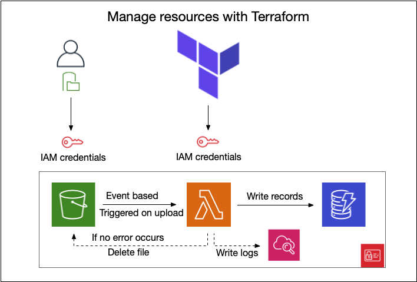

# Import CSV To DynamoDB with Lambda


This Lambda function (Python) imports the content of an uploaded CSV file from S3 into DynamoDB. This Lambda function is only triggered when a .csv file is uploaded to the specific S3 bucket, which will be created. Resources are created with Terraform as visualized with the following image.

<p align="center">
  
</p>

---

## Python script
The Python script is pretty straight forward. It loads some modules and reads the event (triggered from S3 when a .csv file is uploaded), sets some variables (ex. recordttlepoch for DynamoDB Time to Live (TTL)). After splitting the row, it writes the row values to the DynamoDB Table with a unique identifier and current date time value. After completion, the script will delete the processed file(s). This behavior can be changed by deleting / commenting out the line line ```s3_cient.delete_object...```. 

### Warning!
>***The included Python script will delete your uploaded CSV file(s), once the records are imported to DynamoD. If you wish to keep the file(s), comment/delete the line ```s3_cient.delete_object...``` from python script. 
DynamoDB has also a record TTL set to 4 hours! Dissable this behavior by changing the value of ttl attribute `enabled` to ```false``` in file [DynamoDB.tf](DynamoDB.tf)***

---

## Prequest

You need the following to run the code:

- [Terraform >= 1.0.11](https://www.terraform.io/downloads.html)
- [AWS Account](https://aws.amazon.com) (with  'AdministratorAccess' role)
- Code editor (ex. [Visual Studio Code](https://code.visualstudio.com/download))

---
### AWS Authentication 
The AWS provider offers a flexible means of providing credentials for authentication. [Visit Terraform Docs](https://registry.terraform.io/providers/hashicorp/aws/latest/docs#authentication) for all possibilities.

For this exercise, we will use the provider variables `aws_key`, `aws_secret` & `aws_region`. You need to set these in the file [varriables.tf](varriables.tf)  

### Terraform files
Terraform will create all resources useing the settings from the following files:

- [IAM.tf](IAM.tf)
  - Inline Policy ( with promissions to S3, Cloudwatch and DynamoDB )
  - Assume Role Policy (for Lambda )
- [S3.tf](S3.tf) 
  - S3 Bucket
- [DynamoDB.tf](DynamoDB.tf)
  - DynamoDB Table with ***[Time to Live (TTL)](https://docs.aws.amazon.com/amazondynamodb/latest/developerguide/TTL.html)*** (Dissable this by changing the value of ttl attribute `enabled` to false in file [DynamoDB.tf](DynamoDB.tf))
- [Lambda.tf](Lambda.tf)
  - Creats the archive.zip file for the Lambda function (script/index.py)
  - Creates the Lambda function using Python 3.8 runtime and sets enviorment variables which can be used by the Lambda function
- [Cloudwatch.tf](Cloudwatch.tf)
  - Loggroup

---

## Create resources
1. Download this repository or use ```git clone https://github.com/erecica/csv-to-dynamodb-with-lambda.git```  
2. Open the downloded repository with your favorite code editor
2. Set varriables in the file [varriables.tf](varriables.tf)
3. Run terraform script
```sh
terraform init
terraform plan
terraform apply
```

After running `terraform apply` (or '`terraform apply --auto-approve`' This skips interactive approval of plan before applying), the script will create all the nessesery resources.

When the Terraform scrits are done, you'll see the follwing output.
+ AWS_DynamoDB_Table = "DynamoDB Table name"
+ AWS_Region         = "AWS Region you enterd"
+ AWS_S3bucket       = "S3 Bucket name you just created" 

---

## Testing

You can test the application with the included files in directory [dummyfiles](dummyfiles/).
If you wish to test with your own csv files, you must meet the following condition:
  - File should be .csv
  - File should have the following structure:
  ```sh 
    string,string,string,string,number
  ```

---

## Cleanup
Execute the following command in your terminal and confirm to delete all created resources.
```sh
terraform destroy
```